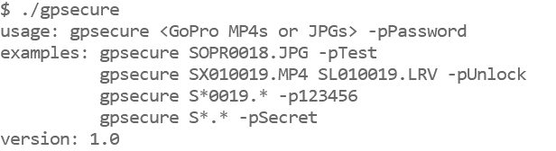

# Media Encryption and Decryption

Our smartphones have pretty good security, the media and data is typically encrypted and locked behind an access key like a pin or face lock. Adding a pin to a GoPro has little value, as the data can be directly accessed via the SD card, but encryption of the SD card would lock the media from prying eyes. GoPro was not designed to do this, it doesn't have hardware level encryption features like a modern smartphone, so this is even more of an experiment than the average Labs feature. Software based encryption can be added to a device like a GoPro, but can be time consuming, and video at 100Mb/s produces a lot of data to protect. So this encryption is designed to be lite enough to be performed in real-time during capture, but that may mean that the data is less secure than the ideal setup. Labs is for fun and experiments, not intended to be a bullet-proof implementation of any feature.

## Enter Your Password

The encryption feature operates like a password protected zip file. Every MP4, JPG, LRV and THM file will be encrypted with the password you provide for activation. The camera will not be able to show your media, and files will not be playable on your PC via the SD card. The media must be decrypted on camera, or with an external tool, using the same password. This is not intended to have the highest level of security, but it is a good level of privacy when using a sufficiently long and complex password. **If the password is forgotten, there is no recovery of the data.** The encryption is using 128-bit AES, and you provide the password via a QR Code. As the QR Code itself is not encrypted, do not print or save the QR code image if you intend to be as secure as possible. Also your password is a weak point, security will depend greatly on its length (up to 16 characters are supported.)  

Encrypted media has the first character of the GoPro style filename changed from ‘G’ to ‘S’. 'S' for secure. e.g. A 4K60 MP4 will encrypted with a name like SX014423.MP4.

Set the password to nothing to disable the encryption.

Your password: <input type="text" id="addpass" value=""> 4-16 characters to activate, empty to deactivate  

## Decrypting Your Media

Capturing encrypted content is straight forward, show the QR Code with password, acknowledge on camera, then shoot as normal. Decrypting is less so.  During capture of say 30 minutes, the camera takes 30 minutes to encode, encrypt and store the data, i.e. real-time. For decryption, all 30 minutes of data has to be read back into memory, decrypted and written back to the SD card, double the amount of work on the SD Card. This is very dependent on the SD card speed, decryption can take 100 - 150% of the capture time when performed on camera.  It is best to be USB powered when doing a large amount of decryption. **Warning: If the passwords do not match, the data is doubly encrypted, there is no recovery of the data. Be careful.**

For a desktop shell tool, precompiled for [Windows](https://github.com/gopro/labs/tree/master/docs/control/encrypt/win/gpsecure.zip), [OS X](https://github.com/gopro/labs/tree/master/docs/control/encrypt/osx/gpsecure.zip) and [Linux x86](https://github.com/gopro/labs/tree/master/docs/control/encrypt/linux/gpsecure.zip).
Source [code](https://github.com/gopro/labs/tree/master/docs/control/encrypt/src) uses MIT Licensing, and the embedded [AES Code](https://github.com/kokke/tiny-AES-c) uses The Unlicense.

## What is not encrypted.  

The MP4 file structure itself is not encrypted, it remains an indexable, trimmable file. So you can learn about the shooting length, frame rate, and resolution, etc. The metadata is not encrypted, so GPS and IMU data is still exactable. WAV files are not encrypted, so Protune audio is disabled when using the encryption feature. And not every byte is encypted within the H264/HEVC/AAC data, in some streams only about 3% of the data is encrypted. This is the trick that makes it all work, i.e. real-time on camera, the data is only obfuscated enough to break decoding. So there is challenge for security experts here, can you make a decodable image, without cracking the password?  

## QR Code

<input type="checkbox" id="permanent" name="permanent"> <label for="permanent">Make this name change permanent (Risky!)</label> 
<input type="checkbox" id="encrypt" name="encrypt" checked> <label for="encrypt">Encryption</label> (disable for decryption) 

QR Command: <b id="qrtext">time</b> 

**Compatibility:** Labs enabled HERO9 only
        
## ver 1.0
[Learn more](..) on QR Control

