# Extensions and Other Additions

<script src="../../jquery.min.js"></script>
<script src="../../qrcodeborder.js"></script>
<script src="../../html2canvas.min.js"></script>
<style>
        #qrcode{
            width: 100%;
        }
        div{
            width: 100%;
            display: inline-block;
        }
</style>

## Extensions and Metadata Features

All camera extensions are stored in your camera's metadata, this metadata is helpful for detemining what features are used per clip.
The metadata, and the features it enables, can be [extracted with this page](../metadata).

All metadata QR commands are written in the form <b>$wxzy</b>=value(s) or <b>*wxzy</b>=value(s) -- where the four character code (4CC) 
**wxzy** is under your control, along with the data it stores. All camera support the <b>!Mwxzy=</b> version will permanently store the metadata, and the **oMwxzy=** 
will store it for only this power-on session. HERO10 or newer support the simplified <b>*wxzy=</b> and <b>$wxzy=</b> notation for permanent and temporary storage. 
Camera Metadata is available to flag your files for special uses, or just to label the [camera owner](../owner). 
Some particular 4CCs will also change camera behavior and/or enable features. 

Here is a list of additional metadata driven camera extensions: 

### **HERO13 cameras**

- **WBDV=1** - White Balance DiVe improvements. Rather than WARM for improving diving white balance, which effects WB the same at all depths, WBDV is more automatic – as the scene get more blue, the more the red channel is gain up. Currently $WBDV=1 is uses =2.33,4.0 internally (gaining red 4x after red gain hits 2.33), so you can try tuning this yourself e.g. $WBDV=2.4,5.0
- **SHEL=1** - Using $SHEL=1 enables a command shell for Labs over a USB serial port. Every experimental, and looking for feedback. Connect to COM at 115200 8N1. All QR code command work, just type them. Used $ commands will report their data back to the shell, e.g. $BITR or $A or $p:T to read variables.
- **OPNW=1** - Open Network (allows of faster non-secure http vs https to be used with Open GoPro)
- **DIST=x** - Time-Lapse Video Distance, x is a GPS travel distance between exposures in meters, rather than time for an in-camera computed timelapse. So $DIST=5 will set a 5 meter interval for TLV. One exception is when x=1, 10 meters will be used, 1 meter is too noisy (GPS errors.) So this feature is good for 2 meters of larger. For shorter distances or a higher speed, you the new TLV sample rate for 4Hz (p4), for the best distance precision. e.g. mTr5Xp4$DIST=5
- **GOAL=x** - 0 to 60 (or x) MPH speed timing. Not for precision timing, just for fun. Drive safe. It currents a JPEG in MISC for you speed award. All very crude, from a recent hackathon.
- **GPSL=x** - to enabled continous GPS location logging, even when not capturing, so the capture can log more of you path and adventures. Path is saved by day into 
MISC/GPS-yy-mm-dd.gpmf file. GPSL=1 logs everything, GPSL=x will only log movement great than x meter from the last stored location.


### **HERO13/12 cameras**

- **DIVE=1** - optimizing the Hypersmooth stabilization for underwater. It might be no surprise, but HyperSmooth is designed for the camera operation above the water's surface, 
underwater there is typically less camera shake, and HS is still 70% effective at removing shake. The hack adapts HS to use the refractive index (RI)
of water (defaults to 1.335, good for fresh and command salt water), to remove closer to 100% of unwanted shake. Note: if you know your area's RI is significantly different, 
use DIVE=r, where r can be 1.3 to 1.45 is supported.
- **WARM=x** - WARM maybe useful with DIVE, so you can improve the red respond for deeper dives. x range -50 to 100. Reducing or increasing red signal only.
- **COOL=x** - COOL maybe useful with DIVE, so you can decrease the blue respond for deeper dives. x range -50 to 100. Reducing or increasing blue signal only.
- **MMSK=x** - for auto generating a mask for the new motion detector.
- **OLTC=x** - frame offset to LTC, enabling calibration you are seeing any offset.
- **RLTC=1** - to enable LTC timecode reading from line-in audio.
MISC/GPS-yy-mm-dd.gpmf file. GPSL=1 logs everything, GPSL=x will only log movement great than x meter from the last stored location.
- **STOP=x** - A Stop Motion extension where is x the number for frames to store per shutter press. This modify timelapse video. It is recommend to make a stop motion preset with this command ```mT$PRES="0,STOP"mTr5Xp4``` Works great with the remote. Mode button ends capture. 
- **ONIO=x** - Onion percentage used for Stop Motion where is x the precentage of transparency of the onion skin.
- **PRES=x,name** - Added creating, naming and sharing presets where x 0-32 for icon selection (-1 for delete), and 'name' is your named preset. e.g, QR Command **oMPRES="14,Scuba"**


### **HERO13/12/11/Mini cameras**

- **WIDE=1** This offers a color gamut like setting white balance to Native (wider gamut), while enabling auto whitebalance, or user controlled whitebalance. With WIDE off (0 - the default), the camera saturates color to the Rec709 gamut (basically sRGB), so some extreme real-world color saturations are clipped by the gamut. With WIDE=1, the gamut is sensor native, not Rec709, not Rec2020, just what the sensor sees.
<br>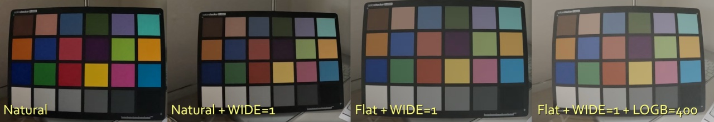
- **WBLK=1** This is an auto lock for balance, it auto white balances until the capture starts. The feature was added for scuba users, as fixed white balance are computed for above water, and while the auto works great in dive scenarios, some prefer a fix white balance per clip.
- **MTRX=a,b,c,d,e,f,g,h,i** This is the RGB to YUV matrix, new ways to mess up your video. e.g. For an B/W effect in camera try oMMTRX=50,175,25,0,0,0,0,0,0<br>
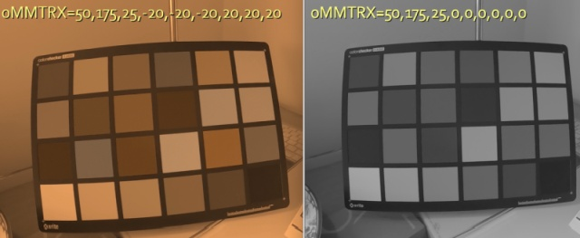<br>
- **GCMP=1** Disables gyro compensated exposure. This is users not concerned about Hypersmooth stabilization, and would prefer the auto exposure to use a longer shutter, rather than more sensor gain.  Longer shutters are worse for stabilization, so the HERO11-13 is smart, it will shorten the shutter if it detects the camera's movement.  GCMP=1 disables this feature.
- **64BT=32000** HERO11-13 cameras default to 12GB chapters when using 64GB card (or larger media), but you can use the 64BT command to specify even larger chapters like 32GB or even 64GB. There has been very limited testing, so experiment first before committing to super large chapters. 
- **PRXY=x** Normally a camera will encode a LRV (Low Res Video) for every MP4, this extension stores LRVs as Proxy files. 1 - moves LRVs as Adobe Premiere Pro™ style, 2 - moves THMs, 3 moves both into the proxies folder, 4 - uses DaVinci Resolve™ style proxies folder. 
When PRXY=1 is enabled, you get. Use Premiere Pro’s Attach Proxies function, greatly speeding up a professional workflows.
&nbsp;&nbsp;&nbsp;&nbsp; `DCIM/100GOPRO/GX013784.MP4`<br>
&nbsp;&nbsp;&nbsp;&nbsp; `DCIM/100GOPRO/GX013785.MP4`<br>
&nbsp;&nbsp;&nbsp;&nbsp; `DCIM/100GOPRO/Proxies/GX013784_Proxy.MP4`<br>
&nbsp;&nbsp;&nbsp;&nbsp; `DCIM/100GOPRO/Proxies/GX013785_Proxy.MP4`<br>
When PRXY=4 is enabled, the LRV files will be created with name naming that is ready for DaVinci Resolve, greatly speeding up a professional workflows. The new folder structure is:<br>
&nbsp;&nbsp;&nbsp;&nbsp; `DCIM/100GOPRO/GX013784.MP4`<br>
&nbsp;&nbsp;&nbsp;&nbsp; `DCIM/100GOPRO/GX013785.MP4`<br>
&nbsp;&nbsp;&nbsp;&nbsp; `DCIM/100GOPRO/Proxy/GX013784.MP4`<br>
&nbsp;&nbsp;&nbsp;&nbsp; `DCIM/100GOPRO/Proxy/GX013785.MP4`<br>
Note: When this feature is enabled, the lack of LRVs will mean the Quik App will not be able to preview video on the camera. However, this will not prevent the full resolution transfers, or on camera playback.
- **GUID=aspect,aspect,...** - Displays an on-scene shooting guide for different aspect ratios, independent from the camera's current video mode. 
Up to 8 guides supported at once. e.g. GUID=1.777 will enable a 16:9 guide. GUID=2.35,0.5625 will add guides for Cinemascope and 9:16 social.
<br>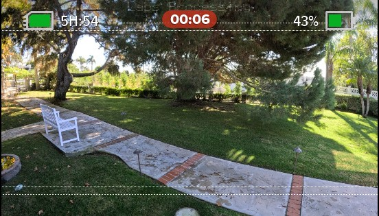
- **GUIC=level,level,...** - The shooting guides default to white at 255, but you can select their luma level. e.g. GUIC=255,0, will be white for the first guide and black the for second.
- **EXPS=1** - Display the current ISO and shutter speed being used during preview and capture. For 11-Mini EXPS=num, 
the number relates to how often the record time or shooting mode is displayed (values 1 thru 6, 1 - displays exposure more, 6 - record time more.)
<br>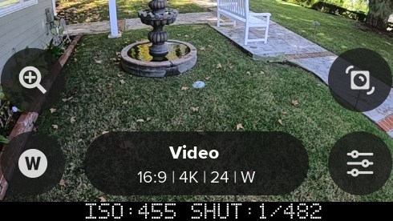 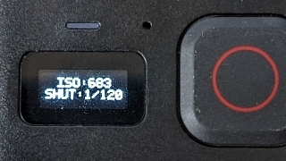
- **EXPX=x** and **EXPN=n** - exposure shutter time mi(n) and ma(x). e.g. oMEXPX=48 (for 1/48) and oMEXPN=500 (for 1/500)
- **EXPQ=x** - exposure Quick shutter, same as $EXPX=x$EXPN=x, setting min and max shutter to the same value
- **FEAT=x** - Display the permanent Labs feature active for x seconds. It is easy to miss the start-up message, this QR command redisplays that message.
- **GRAB=x** - Screen grab 'x'-frames, grab next 'x' Labs overlays - frame grab the UI. Useful for education and bug reporting.
- **HSTP=x,z,size** - Used with HIST=1, this sets the size (40-100) and position (x,y as 1-100) of the histogram. 
A negative x-value will place the histograme on the front screen. e.g. oMHSTP=1,83,67 or oMHSTP=-3,55,87.
<br>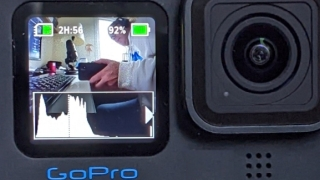
- **LEVL=size** - Add a spirit level to the rear LCD, where the size can be 1-9. e.g. oMLEVL=6. Color for the spirit level line was added for HERO11 and HERO12. LEVL has three colors with no controls. White - nothing is level. Yellow - the horizon is level. Green - the horizon and pitch is level
<br>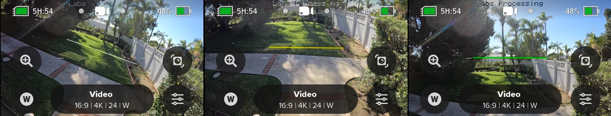
- **LOGB=logbase,offset** - Super experimental, alter the log encoding for more dynamic range, or for a closer match with other camera's log curves. 
i.e design your own flat profile. Ideal for use with 10-bit, and the existing flat color setting.  
e.g. oMLOGB=400 for a little push in dynamic range.  
Note: As the pixel size isn't changing, that increasing the logbase (flatness) may not significantly increase the dynamic range.
<br>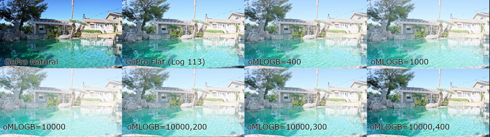
<br>[GoPro Log curve designer](https://www.desmos.com/calculator/sfxqtunzty)
- **NR01=x** - Noise Reduction control, which should be combined with the LOGB control. e.g. oMNR01=50 range 1-100, 100 being 100% active (default), so 1 is the noisest. 
When pushing the dynamic range of any camera, shadow details may be suppress by noise reduction. 
Increasing the logbase will enhance the shadows, but will also reveal noise reduction artifacts tuned for a different encoding curve (the more consumer friendly Rec709.)  
You can back-off the noise reduction to restore shadow details, with the downside being a noiser image (protentially requiring noise reduction in post.)  
Also a noiser image will need a higher-bitrate to store the additional information (so BITR, NR01 and LOGB are all related.) 
- **BYPS=1** - Bypass common pop-ups, such as resetting the time and date. Remember to set time and date if you remove the battery.
- **BERS=x** - 1 - Bypass ERS compensation. 2 - Bypass ERS only with stablization disabled. Not commonly used.
- **IWFR=1** - Increased Write FRequency to support for higher precision file recoveries (this is also defaulted on with !MBITR=x bitrate changes). If you have ever had a big crash that ejects the battery, you may have noticed the file recovery will miss 5-15 seconds of your video. Missing even the lead up to the great moment. This hack increases the rate in which video data is flushed to the SD Card, improving the recoverability for footage. With this enabled, battery ejects will not lose more than 1-2 seconds of footage.  Great for FPV users. Not commonly used.
- **TUSB=1** - Trust USB power.  Some USB power sources may report less than they are capable. This modification assumes the USB Power source is 2A minimum, and disables the testing. This can help with some USB power sources that the camera can reject, but are otherwise sufficient to run all camera operations. If you use TUSB with an inadequate power source, expect capture failures.  
- **STDL=x** - Start Delay is milliseconds (default 2000ms, wait before any other commands.) $STDL=100 for less wait. Experimental to improve scripting performance.

Note: the scripting has had a significant update in the March '23 firmware. See section [Assignments, Variables and Math](../actions)

### **HERO13/11 only (GPS feature)**

- **WG84=1** to switch GPS altitude from Mean Sea Level to WGS84 elipsoid.

### **HERO13/12/11/10 and Bones cameras** - Advanced features

- **24HZ=1** - enable film standard 24.0 frame, rather than the default broadcast standard 23.976.  The existing 24p mode(s) will have the new frame rate when this is enabled, all other video modes are unaffected. 
- **AUDS=1** display the approximate audio levels in dB SPL.
- **BITH=3** - set the compression in Mb/s for the H264 encodes. Normally this would be for LRVs at around 4Mb/s. No guaranteed capture reliability using this feature. Input range in Mb/s from 1 to 100. 
- **BITR=120** - set the compression in Mb/s for the Protune High Bitrate setting (HEVC only). Normally this would be around 100Mb/s, however higher (or lower) rates may be achieved with newer SD Cards. No guaranteed capture reliability using this feature. Input range in Mb/s from 2 to 200. Counterintuitively, lower frame rates like 24/25/30fps can use higher bitrates than faster frame rates.  e.g. A camera that is reliable doing 180Mb/s at 24fps, will likely need to drop to 150Mb/s for 120fps. Most GP2 cameras can do 150Mb/s for all video modes, but your testing is still required. Use at your own risk.
- **DAMP=0.1 to 1000** - Control over the auto-exposure damping. When moving a camera through dramatically changing lighting, like biking through a forest, in and out of sunlight, or flying a drone through a short tunnel, the exposure will adjust automatically, correctly in most scenarios, but sometimes not optimal for some rapidly changing light levels. The camera's auto-exposure currently takes about one second to adjust from sunlight to indoor conditions, but if you are flying a drone through indoors for only a few seconds, the camera would over-expose on exit. In this scenario using an exposure lock might be preferable, maintaining an outdoor exposure throwout, but exposure lock is risky for shooting under variable lighting conditions. Changing the damping might be what you need. Setting the DAMP=1 is the default, so setting to 10 would slow the camera's exposure adjustments 10X. Now shooting into dark for moment will not cause much over-exposure (if any).  Setting DAMP=60 will take a minute for exposure changes. Setting DAMP lower than 1, like 0.2, would make it adjust faster. There is no perfect setting, this is just more control. On newer cameras (H11+) tone mapping is not damped by this control, so for the best exposure damping control use Color Flat or GP-Log, as these modes disable tone-mapping.
- **DAUD=1** - Disable audio, all video created video files will have no audio. Application: high bit-rate drones video.
- **DLRV=1** - Disable LRV, all videos will have an MP4 only. This is not good idea for Quik uses, as the LRV video helps in video preview. Note: There is currently a bug in this feature (HERO10 as requires a restart after two captures.) (not supported on H12-13)
- **EVBS=x** Global EV comp bias for all video modes that also works with Live-Stream and web-cam, and can be changed during capture if QRDR=1 is set. As this is global offset, it will add to EV comp settings with your presets.  So if EVBS=-1 and a preset has EV set to -0.5, the effective EV will be -1.5.
- **FAST=1** For fewer Labs notifications on boot. Useful for any script that repeats after a shutdown, and the script will run sooner, and reducting battery consumption.
- **FONT=1** Select the old fonts (if you only want the dot matrix font)
- **FRNT=1** For front screen equipped cameras, display most LCD Labs message on the front screen. Practicular useful for FPV useful not using the touchscreen.  e.g.  !MFRNT=1!MEXPS=1 will display the ISO and shutter speed on the front LCD.
- **STDL=x** All scripts running the **!S** start command, will wait a second or two before the next action. STDL allow you to set this wait time in millisecond, for scripts needing a faster reponse time.
- **TONE=0,1,2 or 3** - Tone-mapping controls. Tone-mapping is the in-camera contrast control, dynamically adjusting the video to look good under a range of lighting conditions. 
HERO10 adds LTM - Local Tone-Mapping, enabling you to see details in leaves and grass textures, way better than all previous GoPro's. HERO9 and earlier, used GTM, Global 
Tone-Mapping which adjusts the contrast curve for the image automatically. If you wanted to do these in post, you could use Protune Flat, where all in-camera tone-mapping is 
disabled and a log curve is applied (do not use these control with Flat, can be weird results.) For a more developed Rec709 video, by shooting GoPro Color or Natural modes, 
but you wanted to do your own tone-mapping in post--you can now do that.  Note: HERO11/12 is a tad odd with TONE=3, as it tends to under-expose. Always experiment before using an feature.
  - **TONE=0** - using the cameras default  
  - **TONE=1** - use GTM only
  - **TONE=2** - use GTM+LTM
  - **TONE=3** - disable all tone-mapping
- **FSOS=1** - Scan the SD for files that can be repaired (truncated). Normal file recovery checks only the last file captured, this checks and fixes them all.

### Miscellaneous controls for most Labs cameras. 

- **BOOT=!Lscript** - A command to run automatically at boot. For safety, this should only be a load script command, so that the command is dependent on the SD card presence. e.g. !MBOOT="!Lboot"  Then you can place whatever command you need in the boot script with !SAVEboot="your command here". See an example in [IMU Triggers for Drones](../imutrigger)
	- An inventive use of oMBOOT="command", 'oM' commands do not survive power cycles, so this is not a "boot" command, but this style of command will run as a subroutine. 
	- e.g. !10:00NoMBOOT="!SM3D4H5!R" <- Wake at 10am, then motion capture continuously.
	-  vs !10:00N!SM3D4H5!R <- which will wake at 10am, but only motion capture once a day.
- **DBGL=1** - enabled more debug logging. Labs saves it logs to the SD card under MISC/qrlog.txt. Using this extension increases the details and logged events.
- **DSPC=value**, this sets that contrast for which messages are displayed.  Contrast is from 0 - transparent text background, to 6 - opaque black background
- **DSPL=time**, this will control the amount of time messages are displayed. For users who want there own information displayed longer. The default is 1 second.  DSPL=1 thru 9 is in seconds.  DSPL = 10 thru 9999 is in milliseconds.  So for much faster messages set DSPL to 100. Set this before setting the owner information, as metadata commands are processed in the order they are stored. 
- **HNDL=x**, where x is 1 to 31, setting the camera ID for a camera. This is for rare scenarios where multiple cameras see the same QR Code, and you only want particular cameras to respond. This combined with **hZ** command where Z is the bit mask for which cameras will follow the command.
	- e.g.   h6mP!S  ← this command will only run on cameras with IDs 2 and 3.
    - e.g.   h1mVh2mPB ← set camera 1 to mode Video and camera 2 to Photo Burst.
- **HIST=x** - Displays a histogram with contrast from 1 to 11. e.g. try setting HIST to 5. HIST=0 will disable it.  On 11-Mini the number is a display duratrion.
<br>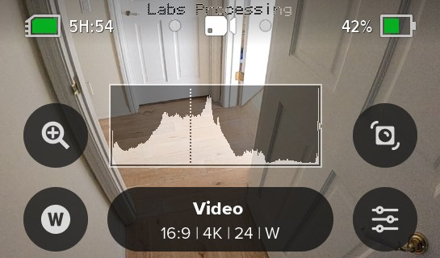 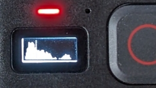
- **HSTO=x** - minutes - controlling the length of the Hindsight timeout, changing from the default for 15 minutes. e.g. !MHSTO=60 for a 60 minute Hindsight timeout.
- **LLTZ=latt,long,timezone** for those want to use Sunset/Sunrise timelapse without GPS, or for when you are shooting a sunset timelapse from indoors. The metadata is used to store your GPS Location and timezone e.g. !MLLTZ=33.126,-117.327,-8.0  In this case you must used the !M command, permanent storage, as solar event timers will shutdown the camera.
- **QRDR=1** - detect QR Codes while recording, or even Quik Preview. This also enables Labs BOOT commands to work with QuikCapture in recent models. Normally this feature is disabled to ensure the lowest computing load impact, so not enabling this is the safest. However, it is needed for some cool ideas, like changing a video burnin message in the middle of a live-stream, or changing its exposure with BIAS (see below.) This also allows you to end a capture via a QR Code (command: !E). oMQRDR=0 will disable it.
- **SPED=1** - SD Card Speed Test, only really useful on older cameras (HERO9 or older.) GP2 cameras are faster and generally require faster SD cards anyway. It still works on newer cameras, but the results are misleading, are often way higher than what the encoder can support (i.e. don't set BITR to 200 because you card writes at 500Mb/s.)
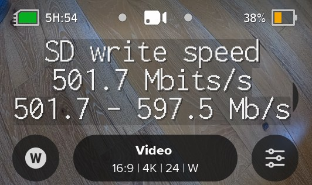
- **TCAL=milliseconds** - Timecode CALibration, help to increase the precision of setting timecode via QR Code. The milliseconds can be positive or negative as needed.
- **WAKE=1** - This will make the camera wake on any power addition, but only if there is a delay action pending (determined by a delay.txt file in the MISC folder, created automatically with wake timer events.) Inserting a battery or the connection of USB power, will boot up the camera to continue a script after a power failure. With some experimentation, this may be used to improve very long time-lapse reliability, by cycling USB power every 24 hours -- reseting the camera to restart scripts.
- **WAKE=2** - (HERO8/10-13 only) Same as WAKE=1, except it will ignore any pending actions, and wake of any power addition. This is useful with combined with a boot command. 
	
### **HERO13/12/11/10/9 & 8** - Overlay extensions
Older GP1 based cameras support overlays in video and video time-lapse modes. Overlays are not supported in Photo mode.

#### GP2 limitations - Video Modes
- Resolution: 1080 Frame Rates: 24, 30, 60, 120 Aspect Ratios: 16:9 
- Resolution: 2.7K Frame Rates: 60 Aspect Ratios: 16:9 
- Resolution: 4K Frame Rates: 24, 30 Aspect Ratios: 16:9, 4:3, 8:7
- Resolution: 5.3K (not supported)

#### GP2 limitations - Time-lapse Modes
Only Time Warp preset is supported.
- Resolution: 1080 Aspect Ratios: 16:9  
- Resolution: 2.7K Aspect Ratios: 4:3 
- Resolution: 4K Aspect Ratios: 16:9, 4:3 
- Resolution: 5.3K (not supported)

#### Overlay Commands

- **BRNT=0.5** - The overlays or burn-in display time in seconds. e.g. BRNT=0.016 will display the logo or text overlays only on the first frame (1/60th of a second.) 
- **BRNX=x,y** - This is an upgrade to BRNO (Burn-ins Offset), allowing you to offset the burn-ins with X,Y pixel coordinates. e.g. BRNX=120,40
- **CBAR=1** - enable a small 75% saturated color bars for video tools evaluation (HERO10-13 has a GP2 limitation: only works 4Kp30 or lower res/fps.)
- **LBAR=1** - enable a small luma sweep for video tools evaluation  (HERO10/11 limitation: only works 4Kp30 or lower res/fps.)<br>
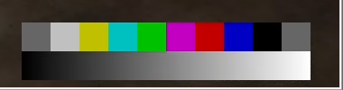
- **LOGO="filename.png"** - overlay a small logo or icon on the encoded video. The logo must be stored on the SD card in the MISC folder. The alpha channel is supported. The PNG files must be less than 64kBytes with fewer than 64k pixels, e.g. Logo overlay of 400x100 works, but 400x200 will not. The smaller the better for demanding video modes like 4K60 and 1080p240.  (HERO10/11 limitation: only works 4Kp30 or lower res/fps.) 
<br>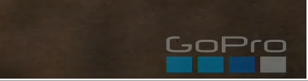
<!-- - **SHMX=time** - SHMX is similar Maximum Shutter Angle (EXPT), except it applies to Photos. e.g. SHMX=1000 would set 1/1000th of a second as the longest shutter time. Use case: action photography in lower light. -->
<!-- - **ENCR="password 4-16 characters"** - Enabled media encryption during capture. All new media will be encrypted, with no camera or desktop playback without decryption via your password first. This is not intended to have the highest level of security, but it is a good level of privacy when using a sufficiently long and complex password.  <span style="color:red">If the password is forgotten, there is no recovery of the data.</span> If the <span style="color:red">wrong password is used</span> to decrypt, the data is doubly encrypted, <span style="color:red">there is no recovery of the data.</span> Encrypted media has the first character of the GoPro style filename changed from 'G' to 'S'. e.g. A 4K60 MP4 will encrypted with a name like SX014423.MP4. The .THM, .LRV and .JPG files are also encrypted.-->
<!-- - **DECR="password"** - Decrypt existing encrypted files. <span style="color:red">If the passwords do not match,</span> the data is doubly encrypted, <span style="color:red">there is no recovery of the data. **Be careful**.</span> With the correct password, all files are decrypted on camera. The onto camera process is slow, and the entire encrypted file must be read and rewritten, expect a similar processing time to the capture length. If low battery is an issue, provide the camera external power before decryption.-->

### **HERO13/12/11/10 and 9** - Audio and MediaMod extensions

- **GAIN=dB** - Digitally gain up the audio. e.g. oMGAIN=12, increase audio by 12dB.  Will likely reduce the dynamic range.- 
- **HDMI=0,1 or 2** - Media Mod users can change the output default from Gallery (0) to clean monitoring with no overlays (1), or monitoring live video with overlays (2).
- **MUTE=mask** - Mute one or more channels of audio (microphones). For HERO9 cameras, there are four channels, although three microphones. The mask is binary mask for channels 4321. e.g. oMMUTE=15 mute all channels (15 = 1111B), oMMUTE=8 mute the fourth channel (8 = 1000B), oMMUTE=7 mutes the first 3 channels (7 = 0111B).
- **SOLO=channel** - Use only one channel of audio. e.g. oMSOLO=1 use only channel 1, oMSOLO=4 only use the fourth channel.

  

<input type="checkbox" id="perm" name="perm"> 
<label for="perm">Make metadata Permanent (are you sure?)</label><br>
Metadata Four CC: <input type="text" id="addcmd" value="">  e.g. BIAS, HIST etc.<br>
Metadata Value(s): <input type="text" id="addvalue" value="">  e.g. 2.0 or "Joe Blogg", strings in quotes, numbers comma separated.

<div id="qrcode_txt" style="width: 360px">
  <center>
  <div id="qrcode"></div><br>
  <b><font color="#009FDF">GoProQR:</font></b> <em id="qrtext"></em><br>
  </center>
</div>
<button id="copyImg">Copy Image to Clipboard</button>
<br>
<br>
Share this QR Code as a URL: <small id="urltext"></small><br>
<button id="copyBtn">Copy URL to Clipboard</button>


## Alternative Exposure Controls. 

- EV adjustments. While you can just see an EV value you can now use x++ to increase from the current EV and x-&nbsp;- to decrease. This might be useful for dive application, as you can't change EV while under water 

- White Balance adjustments, with w++ and w-&nbsp;- will increase or decrease white balance.
 Again for dive users.

<br> 

updated: September 7, 2025<br>

[Learn more](..) on QR Control

<script>
var once = true;
var qrcode;
var clipcopy = "";
var cmd = "";
var lasttimecmd = "";
var changed = true;

function makeQR() 
{	
  if(once === true)
  {
    qrcode = new QRCode(document.getElementById("qrcode"), 
    {
      text : "!MSYNC=1",
      width : 360,
      height : 360,
      correctLevel : QRCode.CorrectLevel.M
    });
    once = false;
  }
}

function HTMLPrint(txt)
{
	var txt2 = txt.replaceAll("<", "&#60;");
	var newtxt = txt2.replaceAll(">", "&#62;");
	return newtxt;
}
function URLPrint(txt)
{
	var txt2 = txt.replaceAll("+", "%2B");
	var txt3 = txt2.replaceAll("#", "%23");
	var txt4 = txt3.replaceAll("%", "%25");
	var txt5 = txt4.replaceAll("&", "%26");
	return txt5;
}

function timeLoop()
{
	if(document.getElementById("addcmd").value.length !== 4)
		cmd = "\"Metadata 4CCs must be\\nfour characters long\"";
	else if(document.getElementById("addvalue").value.length === 0)
		cmd = "\"Metadata requires\\nvalid data\"";
	if(document.getElementById("addcmd").value.length === 4 && document.getElementById("addvalue").value.length > 0)
	{
		cmd = "oM";
		if(document.getElementById("perm") !== null)
		{
			if(document.getElementById("perm").checked === true)
			{
				cmd = "!M"
			}
		}
		cmd = cmd + document.getElementById("addcmd").value + "=" + document.getElementById("addvalue").value;
	}
	
	
	qrcode.clear(); 
	qrcode.makeCode(cmd);

	if(cmd != lasttimecmd)
	{
		document.getElementById("qrtext").innerHTML = HTMLPrint(cmd);
		clipcopy = "https://gopro.github.io/labs/control/set/?cmd=" + URLPrint(cmd);
		document.getElementById("urltext").innerHTML = HTMLPrint(clipcopy);
		changed = true;
		lasttimecmd = cmd;
	}

	if(changed === true)
	{
		document.getElementById("qrtext").innerHTML = cmd;
		changed = false;
	}

	var t = setTimeout(timeLoop, 50);
}

function myReloadFunction() {
  location.reload();
}


async function copyImageToClipboard() {
    html2canvas(document.querySelector("#qrcode_txt")).then(canvas => canvas.toBlob(blob => navigator.clipboard.write([new ClipboardItem({'image/png': blob})])));
}
async function copyTextToClipboard(text) {
	try {
		await navigator.clipboard.writeText(text);
	} catch(err) {
		alert('Error in copying text: ', err);
	}
}

function setupButtons() {	
    document.getElementById("copyBtn").onclick = function() { 
        copyTextToClipboard(clipcopy);
	};
    document.getElementById("copyImg").onclick = function() { 
        copyImageToClipboard();
	};
}

makeQR();
setupButtons();
timeLoop();

</script>
