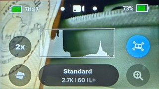
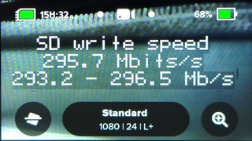

# Extensions and Other Smaller Additions

After the release of the the first Labs firmware for HERO8, we heard the feedback and added features wherever possible. Some of the more major features got their own page, the rest are documented in this collection.

## Miscellaneous Metadata controls. 

All metadata QR commands are written in the form oM**wxzy**=value(s) or !M**wxzy**=value(s) -- where the four character code (4CC) **wxzy** is under your control, along with the data it stores. The **!M** version will permanently store the metadata, and the **oM** will store it for only this power-on session. Metadata is available to flag your files for special uses, or just to label the [camera owner](./owner). Some particular 4CCs will also change camera behavior and/or enable features. Here is a list of additional metadata driven controls: 

- **LLTZ=latt,long,timezone** for those want to use Sunset/Sunrise timelapse without waiting for GPS lock, or for when you are shooting a sunset timelapse from indoors. The metadata is used to store your GPS Location and timezone e.g. !MLLTZ=33.126,-117.327,-8.0  In this case you must used the !M command, permanent storage, as solar event timers will shutdown the camera.
- **QRDR=1** - detect QR Codes while recording.  Normally this feature is disabled to ensure the lowest computing load impact, so not enabling this is the safest. However, it is needed for some cool ideas, like changing a video burnin message in the middle of a live-stream, or changing its exposure with BIAS (see below.) This also allows you to end a capture via a QR Code (command: !E). oMQRDR=0 will disable it.
- **BIAS=ev_value** - This is a crude EV compensation for modes that don’t have Protune settings, like Live-stream. e.g. oMBIAS=2.0 (do not make this permanent as it can impact all video modes.) Not supported on HERO10.
- **HNDL=x**, where x is 1 to 31, setting the camera ID for a camera. This is for rare scenarios where multiple cameras see the same QR Code, and you only want particular cameras to respond. This combined with **hZ** command where Z is the bit mask for which cameras will follow the command.
	- e.g.   h6mP!S  ← this command will only run on cameras with IDs 2 and 3.
    - e.g.   h1mVh2mPB ← set camera 1 to mode Video and camera 2 to Photo Burst.
- **DSPL=time**, this will control the amount of time messages are displayed. For users who want there own information displayed longer. The default is 1 second.  DSPL=1 thru 9 is in seconds.  DSPL = 10 thru 9999 is in milliseconds.  So for much faster messages set DSPL to 100. Set this before setting the owner information, as metadata commands are processed in the order they are stored. 
- **DSPC=value**, this sets that contrast for which messages are displayed.  Contrast is from 0 - transparent text background, to 6 - opaque black background
- **HIST=x** - Displays a histogram with contrast from 1 to 11. e.g. try setting HIST to 5. HIST=0 will disable it.

- **LAPS=1** turns on the burn-in laptime, a hackathon designed for live-streaming auto races. LAPS=0 will disable it. **HERO8/9 only**
	- **BRNP=”xx”**  this the burnin position TL, TR, BL, BR (default) - T-Top L-Left B-Bottom R-Right, e.g. oMBRNP="TR"
	- **LFIN=latt,long** GPS location for the Lap Line (finish line), used to compute the lap times. e.g. !MLFIN=36.586221,-121.756818 The finish line at Laguna Seca. You need a high degree of GPS precision for this to work correctly.
	- **LSRT=”hh:mm”** - Lap times starting at time HH:MM, so you can put in the race start time.
	- **LDVR=”Driver Name”** - displays "Driver", with the name you provide
	- **LRDR=”Rider Name”** - displays "Rider", with the name you provide
	- **LRUN=”Runner Name”** - displays "Runner", with the name you provide
- **BOOT=!Lscript** - A command to run automatically at boot. For safety, this should only be a load script command, so that the command is dependent on the SD card presence. e.g. !MBOOT="!Lboot"  Then you can place whatever command you need in the boot script with !SAVEboot="your command here". See an example in [IMU Triggers for Drones](../imutrigger)
	
### **HERO9/10 only** - Extensions latest Labs firmware

- **WAKE=1** - This will make the camera wake on any power addition, but only if there is a delay action pending (determined by a delay.txt file in the MISC folder, created automatically with wake timer events.) Inserting a battery or the connection of USB power, will boot up the camera to continue a script after a power failure. With some experimentation, this may be used to improve very long time-lapse reliability, by cycling USB power every 24 hours -- reseting the camera to restart scripts.
- **WAKE=2** - (HERO10 only) Same as WAKE=1, expect it will ignore any pending actions, and wake of any power addition. This is useful with combined with a boot command. 
- **MUTE=mask** - Mute one or more channels of audio (microphones). For HERO9 cameras, there are four channels, although three microphones. The mask is binary mask for channels 4321. e.g. oMMUTE=15 mute all channels (15 = 1111B), oMMUTE=8 mute the fourth channel (8 = 1000B), oMMUTE=7 mutes the first 3 channels (7 = 0111B).
- **SOLO=channel** - Use only one channel of audio. e.g. oMSOLO=1 use only channel 1, oMSOLO=4 only use the fourth channel.
- **GAIN=dB** - Digitally gain up the audio. e.g. oMGAIN=12, increase audio by 12dB.  Will likely reduce the dynamic range.
- **SHMX=time** - SHMX is similar Maximum Shutter Angle (EXPT), except it applies to Photos. e.g. SHMX=1000 would set 1/1000th of a second as the longest shutter time. Use case: action photography in lower light. 
- **HDMI=0,1 or 2** - Media Mod users can change the output default from Gallery (0) to clean monitoring with no overlays (1), or monitoring live video with overlays (2).
- **ENCR="password 4-16 characters"** - Enabled media encryption during capture. All new media will be encrypted, with no camera or desktop playback without decryption via your password first. This is not intended to have the highest level of security, but it is a good level of privacy when using a sufficiently long and complex password.  If the password is forgotten, there is no recovery of the data. If the wrong password is used to decrypt, the data is doubly encrypted, there is no recovery of the data. Encrypted media has the first character of the GoPro style filename changed from 'G' to 'S'. e.g. A 4K60 MP4 will encrypted with a name like SX014423.MP4. The .THM, .LRV and .JPG files are also encrypted.
- **DECR="password"** - Decrypt existing encrypted files. If the passwords do not match, the data is doubly encrypted, there is no recovery of the data. **Be careful**. With the correct password, all files are decrypted on camera. The onto camera process is slow, and the entire encrypted file must be read and rewritten, expect a similar processing time to the capture length. If low battery is an issue, provide the camera external power before decryption.
- **SPED=x** - SD Card Speed Test. 'x' is the number of runs, each run is around 10 seconds.  Data rates should have minimums above 120Mb/s is you want to reliably capture the high bitrate modes. 

### **HERO9 only** - Overlay extensions

- **CBAR=1** - enable a small 75% saturated color bars for video tools evaluation
- **LBAR=1** - enable a small luma sweep for video tools evaluation (can be combined with CBAR=1)

- **LOGO="filename.png"** - overlay a small logo or icon on the encoded video. The logo must be stored on the SD card in the MISC folder. The alpha channel is supported. The PNG files must be less than 64kBytes with fewer than 64k pixels, e.g. Logo overlay of 400x100 works, but 400x200 will not. The smaller the better for demanding video modes like 4K60 and 1080p240. 

- **BRNT=0.5** - The overlays or burn-in display time in seconds. e.g. BRNT=0.016 will display the logo or text overlays only on the first frame (1/60th of a second.) 
- **BRNX=x,y** - This is an upgrade to BRNO (Burn-ins Offset), allowing you to offset the burn-ins with X,Y pixel coordinates. e.g. BRNX=120,40

### **HERO10 only** - Advanced features

- **24HZ=1** - enable film standard 24.0 frame, rather than the default broadcast standard 23.976.  The existing 24p mode(s) will have the new frame rate when this is enabled, all other video modes are unaffected. 
- **BITR=120** - set the compression in Mb/s for the Protune High Bitrate setting (HEVC only). Normally this would be around 100Mb/s, however higher (or lower) rates may be achieved with newer SD Cards. No guaranteed capture reliability using this feature. Input range in Mb/s from 2 to 200. 
- **BITH=3** - set the compression in Mb/s for the H264 encodes. Normally this would be for LRVs at around 4Mb/s. No guaranteed capture reliability using this feature. Input range in Mb/s from 1 to 100. 
- **DLRV=1** - Disable LRV, all videos will have an MP4 old. This is not good idea for Quik uses, as the LRV video helps in video preview. Application: high bit-rate drones video.
- **DAUD=1** - Disable audio, all video created video files will have no audio. Application: high bit-rate drones video.
- **DAMP=0.1 to 1000** - Control over the auto-exposure damping. When moving a camera through dramatically changing lighting, like biking through a forest, in and out of sunlight, or flying a drone through a short tunnel, the exposure will adjust automatically, correctly in most scenarios, but sometimes not optimal for some rapidly changing light levels. The camera's auto-exposure currently takes about one second to adjust from sunlight to indoor conditions, but if you are flying a drone through indoors for only a few seconds, the camera would over-expose on exit. In this scenario using an exposure lock might be preferable, maintaining an outdoor exposure throwout, but exposure lock is risky for shooting under variable lighting conditions. Changing the damping might be what you need. Setting the DAMP=1 is the default, so setting to 10 would slow the camera's exposure adjustments 10X. Now shooting into dark for moment will not cause much over-exposure (if any).  Setting DAMP=60 will take a minute for exposure changes. Setting DAMP lower than 1, like 0.2, would make it adjust faster. There is no perfect setting, this is just more control.
- **PRXY=1** **NEW** - Store LRV files as Adobe Premiere Pro™ style proxy files. Normally a camera will encode and LRV (Low Res Video) for every MP4 using this standard directory structure: 
&nbsp;&nbsp;&nbsp;&nbsp; `DCIM/100GOPRO/GX013784.MP4` 
&nbsp;&nbsp;&nbsp;&nbsp; `DCIM/100GOPRO/GL013784.LRV` 
&nbsp;&nbsp;&nbsp;&nbsp; `DCIM/100GOPRO/GX013785.MP4` 
&nbsp;&nbsp;&nbsp;&nbsp; `DCIM/100GOPRO/GL013785.LRV` 
When Proxies are enabled, the LRV files will be created with name naming that is ready for Premiere Pro's **Attach Proxies** function, greatly speeding up a professional workflows. The new folder structure is: 
&nbsp;&nbsp;&nbsp;&nbsp; `DCIM/100GOPRO/GX013784.MP4` 
&nbsp;&nbsp;&nbsp;&nbsp; `DCIM/100GOPRO/GX013785.MP4` 
&nbsp;&nbsp;&nbsp;&nbsp; `DCIM/100GOPRO/Proxies/GX013784_Proxy.MP4` 
&nbsp;&nbsp;&nbsp;&nbsp; `DCIM/100GOPRO/Proxies/GX013785_Proxy.MP4` 
Note: When this feature is enabled, the lack of LRVs will mean the Quik App will not be able to preview video on the camera. However, this will not prevent the full resolution transfers, or on camera playback.

- **TCAL=milliseconds** **NEW** - Timecode CALibration, help to increase the precision of setting timecode via QR Code. The milliseconds can be positive or negative as needed.
- **TONE=0,1,2 or 3** - Tone-mapping controls. Tone-mapping is the in-camera contrast control, dynamically adjusting the video to look good under a range of lighting conditions. HERO10 adds LTM - Local Tone-Mapping, enabling you to see details in leaves and grass textures, way better than all previous GoPro's. HERO9 and earlier, used GTM, Global Tone-Mapping which adjusts the contrast curve for the image automatically. If you wanted to do these in post, you could use Protune Flat, where all in-camera tone-mapping is disabled and a log curve is applied. For a more developed Rec709 video, by shooting GoPro Color or Natural modes, but you wanted to do your own tone-mapping in post--you can now do that.
  - **TONE=0** - using the cameras default  
  - **TONE=1** - use GTM only
  - **TONE=2** - use GTM+LTM
  - **TONE=3** - disable all tone-mapping

<input type="checkbox" id="perm" name="perm"> 
<label for="perm">Make metadata Premanent (are you sure?)</label> 
Metadata Four CC: <input type="text" id="addcmd" value="">  e.g. BIAS, HIST etc. 
Metadata Value(s): <input type="text" id="addvalue" value="">  e.g. 2.0 or "Joe Blogg", strings in quotes, numbers comma separated.

  

  

 
  <b>GoProQR:</b> <em id="qrtext"></em> 
  

<button id="copyImg">Copy Image to Clipboard</button>
 
 
Share this QR Code as a URL: <small id="urltext"></small> 
<button id="copyBtn">Copy URL to Clipboard</button>

## Alternative Exposure Controls. 

- EV adjustments. While you can just see an EV value you can now use x++ to increase from the current EV and x-&nbsp;- to decrease. This might be useful for dive application, as you can't change EV while under water 

- White Balance adjustments, with w++ and w-&nbsp;- will increase or decrease white balance.
 Again for dive users.

  
		
## ver 1.15
updated: Apr 8, 2022
[BACK](..)

