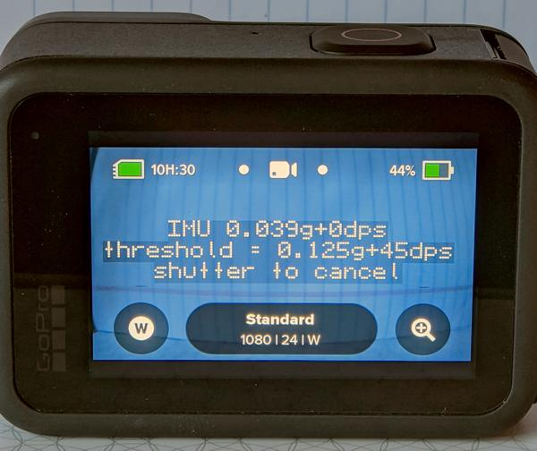

# IMU Detection to Start and Stop Captures

While the motion detection feature looks for changes in the image, this is only looking for motion of the camera itself. The Inertial measurement unit (IMU), has a gyroscope and accelerometer for measuring rotation and linear acceleration, this can now be used to start and stop captures.  Example: Drone use, only capture while in flight, automatically stop recording when motion stops.

## Customize IMU Detected Capture

&nbsp;&nbsp;&nbsp;&nbsp;&nbsp;&nbsp;<b>Sensor:</b>&nbsp;&nbsp;
  <input type="radio" id="imu1" name="imu" value="G" > <label for="GYRO">GYRO </label>&nbsp;&nbsp;
  <input type="radio" id="imu2" name="imu" value="A" > <label for="ACCL">ACCL </label>&nbsp;&nbsp;
  <input type="radio" id="imu3" name="imu" value="I" checked> <label for="BOTH">BOTH</label>

&nbsp;&nbsp;&nbsp;&nbsp;&nbsp;&nbsp;**Start Sensitivity** <input type="range" style="width: 180px;" id="snstvty" name="snstvty" min="1" max="9" value="6"><label for="snstvty"></label>&nbsp;&nbsp;<b id="snstvtytext"></b> 
&nbsp;&nbsp;&nbsp;&nbsp;&nbsp;&nbsp;**End Sensitivity** <input type="range" style="width: 180px;" id="esnstvty" name="esnstvty" min="0" max="9" value="0"><label for="snstvty"></label>&nbsp;&nbsp;<b id="esnstvtytext"></b> 
&nbsp;&nbsp;&nbsp;&nbsp;&nbsp;&nbsp;**Start Delay** <input type="range" style="width: 180px;" id="delay" name="delay" min="0" max="9" value="1"><label for="delay"></label>&nbsp;&nbsp;<b id="delaytext"></b> seconds 
&nbsp;&nbsp;&nbsp;&nbsp;&nbsp;&nbsp;**Hold Time** <input type="range" style="width: 180px;" id="hold" name="hold" min="0" max="60" value="5"><label for="hold"></label>&nbsp;&nbsp;<b id="holdtext"></b> seconds  

&nbsp;&nbsp;&nbsp;&nbsp;&nbsp;&nbsp;<input type="checkbox" id="repeat" name="repeat" checked> 
<label for="repeat">Repeat IMU triggered capture.</label> 

Notes: 
- Sensitivity range: 1-low to 9-high - see table below
- you will have to manually set the mode in which you capture.  The detector can be combined with the Hindsight feature on HERO9. 
 
 

  

  

 
  <b>GoProQR:</b> <em id="qrtext1"></em> 
  <b>IMU Trigger</b>
  

<button id="copyImg1">Copy Image to Clipboard</button>
 
 
Share this QR Code as a URL: <small id="urltext1"></small> 
<button id="copyBtn1">Copy URL to Clipboard</button>

  

  

 
  <b>GoProQR:</b> <em id="qrtext2"></em> 
  <b>Drone Boot Command and Trigger</b>
  

<button id="copyImg2">Copy Image to Clipboard</button>
 
 
Share this QR Code as a URL: <small id="urltext2"></small> 
<button id="copyBtn2">Copy URL to Clipboard</button>

## Using as a Boot Command - Drone Applications 

Now that starting and stopping your GoPro's capture is solved, you also don't want to have to remember to run the script each flight. For a camera dedicated for drone usage (or similar) you can set QR commands that run automatically on boot. This command uses the IMU trigger settings, makes them a boot command (saved to the current SD card,) and enables QR detection while the IMU Trigger is running. Now power-up the drone and power on your GoPro (in some setups this is automatic,) the camera will be ready in seconds. If the drone is stationary, you can use QR Codes to change shooting modes before the flight, or set date and time for cameras that have been without a battery. Once the drone is moving, start and stop capture is automatic. For drone use try a start sensitivity of 4, and end sensitivity of 8, so that an average launch starts the capture, and only rotors off will stop the capture.

## Sensitivity

| Sensitivity | GYRO degrees per second  | ACCL units gravity | Example Camera Activity |
|-------------|--------------------------|--------------------|-------------------------|
| 1           | 360dps                   | 1.0g               | Throwing the camera     |
| 2           | 180dps                   | 0.5g               | Jumps                   |
| 3           | 90dps                    | 0.25g              | most hand-held movement |
| 4           | 45dps                    | 0.125g             | ..                      |
| 5           | 24dps                    | 0.064g             | any hand movement       |
| 6           | 15dps                    | 0.032g             | ..                      |
| 7           | 8dps                     | 0.016g             | ..                      |
| 8           | 4dps                     | 0.008g             | tiny movement           |
| 9           | 2dps                     | 0.004g             | small tremor            |

## On Screen Feedback

**Compatibility:** Labs enabled HERO7, HERO8, HERO9, HERO10 and MAX 

## ver 1.15
[More features](..) for Labs enabled cameras

