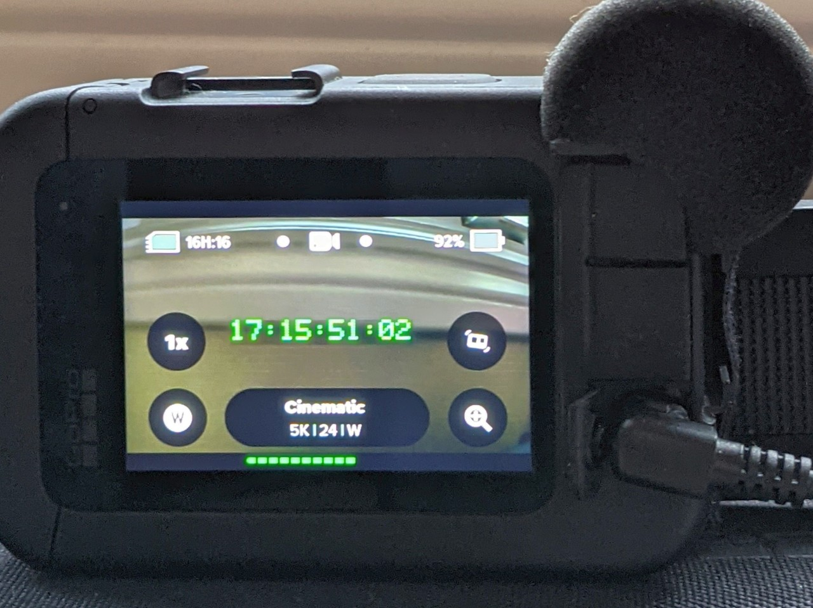
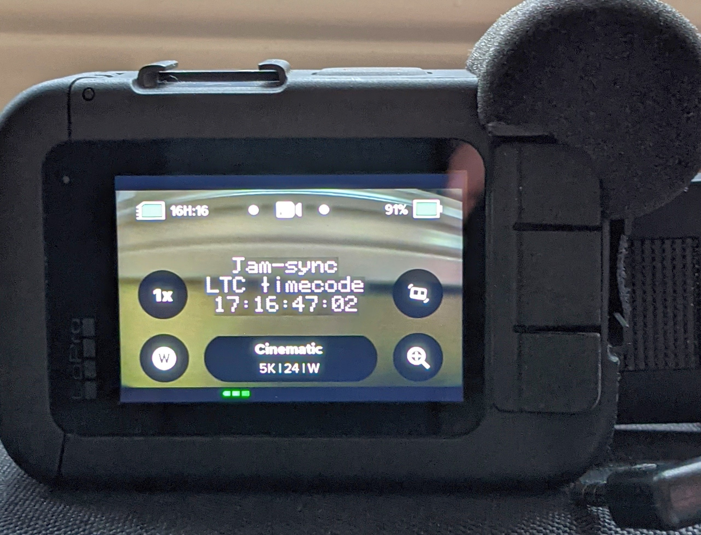

# Timecode Support via LTC Audio Input

This new Labs feature doesn't require a QR Code to activate, however it will only have any effect if you provide Linear TimeCode ([LTC](https://en.wikipedia.org/wiki/Linear_timecode)) using line-in audio via Media Mod or the GoPro Mic Adapter. You will need to select your audio source as Line-In when using Media Mod.

## Two Modes for Timecode Support:

### Continuous Timecode Input

If you attached a device like a [Tentacle Sync](https://tentaclesync.com/sync-e) to your GoPro, timecode input will be continuous. At the start of each capture, the current inputted timecode is sampled, and it is used to update the MP4s timecode track. GoPro has long supported time-of-day Timecode, this is updated to match the timecode input. The timecode will be displayed in green for about 15 seconds. Red timecode or yellow timecode indicate that a clean timecode lock isn't yet final, normally only takes a second or two after initial input. 

### Jam-sync Time-of-Day.

If you don't wish to have a dedicated timecode device attached to your GoPro, you can temporary inject timecode to Jam-sync the camera. When you remove your timecode source, the camera will alter the internal clock to be in-sync with the last received timecode input. While clocks do drift, this approach is good for about hour of timecode sync.
 

**Compatibility:** Labs enabled HERO9-13 only.  Note: Recent firmware updates may require the RLTC feature enabled. Scan *RLTC=1 so the LTC reading will be also enabled at boot. 

        
updated: April 2, 2025

[Learn more](..) on QR Control
