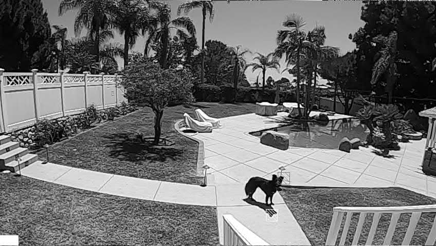

# Video Motion Detection to Start and Stop Captures

While your GoPro camera is not equipped with ultra sonic or another motion sensor, it does have a very high resolution image sensor that is active even when the camera is not recording. So simply using the main imaging engine, the experimental motion detection feature uses the differences between video frames to detect when to start and stop recording. This means your camera should be mounted so that it is not moving, so that only subject moves will trigger the capture. Motion detection can be use to capture video of a shy animal in the wild or simply reduce any video captures to only the moments with activity.

## Custom Motion Capture

**Sensitivity** <input type="range" id="snstvty" name="snstvty" min="1" max="9" value="3"><label for="snstvty"></label>&nbsp;&nbsp;<b id="snstvtytext"></b> (1-low to 9-very high) 
**Start Delay** <input type="range" id="delay" name="delay" min="0" max="60" value="4"><label for="delay"></label>&nbsp;&nbsp;<b id="delaytext"></b> seconds to get yourself out of the way. 
**Hold Time** <input type="range" id="hold" name="hold" min="0" max="60" value="5"><label for="hold"></label>&nbsp;&nbsp;<b id="holdtext"></b> seconds, to continue recording after motion has stopped.  
**Motion Mask**  <input type="range" id="mask" name="mask" min="0" max="20" value="0"><label for="mask"></label>&nbsp;&nbsp;<b id="masktext"></b> seconds, to avoid falsely detecting constantly moving objects like a ceiling fan, or winds blowing leaves. Anything moving during this motion mask time will be ignored as motion triggers. You can also use you fingers to "paint" out regions you want to ignore (e.g. sky to avoid birds triggering capture, when you are also interested in ground activity, or vise versa.) HERO9 and HERO10 only for the mask feature.  

**HERO10 Note:** For motion detection to work on HERO10, the LCD must remain on. For extended motion captures set the LCD brightest low.  

<input type="checkbox" id="repeat" name="repeat" checked> 
<label for="repeat">Repeat motion capture.</label> 

Note: you will have to manually set the mode in which you capture.  Motion detection works is in video, TimeWarp and Timelapse Video modes. 
 

 

QR Command: <b id="qrtext">time</b> 

## Limitations

Due to processing loads on the camera, motion detection will not work correctly for 4K60, 2.7k120 and 1080p240.  The start trigger will work, but once the camera is recording, it can't detect the stop in motion. For full functionality for motion detection, use modes like 4Kp30, 2.7Kp60, or 1080p120 etc.

## After Capture - Finding Your Snow Leopard (or Backyard Dog)

After a couple of hours of repeated motion capture, you are still likely to have many false positives, resulting in more MP4 files than you need. We have a solution to help you narrow down to the best shots. For each capture start, the camera will create a JPEG showing where the motion was detected. So if you are looking for a ground animal and a bird flies by, the detection would show a patch in the sky. The JPEG is stored in the MISC folder, with a matching file number to the MP4 created. Sometimes it is faster to scan these JPEGs to find the videos you want?

The file **MISC\GL013585.jpg** matches capture in **DCIM\100GOPRO\GH013585.MP4**. The cross-hatched boxes show where the motion was detected. 

## Extra Advanced - Custom Motion Masks

Instead of using **Motion Mask** feature, you can create an image mask to determine which part of the scene are used for detection.  
There are many steps. Below is one approach using Windows 10 and a free image tool [IrFanView](https://www.irfanview.com/)
 
1. Mount the camera so it will not move.
2. Shoot a short video in the exact mode you will used for motion capture (e.g. 1080p60 Wide.)
3. Remove the SD Card, without moving the camera.
4. Load the video and screen grab a frame (this frame will be used to determine the mask.)
5. Load this image in IrFanView (or similar)
6. Trim off any chrome (window borders) so you have only the 16:9 video image (or 4:3 if that is your video mode.)
7. Optionally resize to something smaller, 960x540 or 480x270 -- this is so you have less to paint when creating the mask.
8. Use a paint tool (or IrFanView's in-build paint tool), crudely paint over the image in white for image areas you want to detect, and black for everything else.  Only motion detected in the white regions will trigger a capture.  
9. Resize the now black and white image/mask to 36x20  <- yes the mask is tiny, this is why painting can be crude.
10. Save the image to the SD Card within **MISC**, called **mask.pgm** .  PGM is supported image type within IrFanView, it is a Portable GrayMap.
11. Re-insert the SD Card to the camera, again without moving it.

Now your camera is ready.

The motion detection will now always use the mask.pgm, so using motion mask option doesn't do anything. To restore to normal motion detection you need to delete the mask.pgm file.
	
**Compatibility:** Labs enabled HERO7, HERO8, HERO9, HERO10 and MAX.  Masking fixed on HERO9 & 10.
        
## ver 1.07
[Learn more](..) on QR Control

