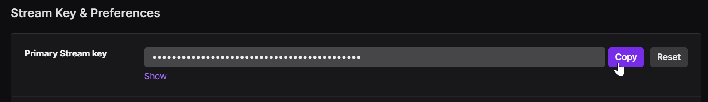

# Live-Stream Setup 

## Prerequisites for Live-streaming (HERO8/9/10/11 & 12)

1. **Pair with the GoPro mobile app once.** Live-streaming won't work with an out-of-box or factory-reset camera, without connecting with the App first. 
On HERO12 it seems you have to enable auto upload once. You can immediately disable it once enabled, if the feature is not needed.
2. Storing WiFi credentials on the camera, for the network you intend to stream over (e.g. your home WiFi or mobile access point.) 
3. Storing the RMTP URL address that you intend to stream to (e.g using a service like Twitch.)

When both of these are stored within your camera's non-volatile memory, you can start a Live-stream with a single QR Code at any time. 
 

## Pre-store Your WiFi Credentials 

Your Network Name (SSID): <input type="text" id="networkname" value=""> (e.g. HomeWiFi) 
Your Network Password: <input type="text" id="networkpass" value=""> (e.g. Pass1234) 

 

<b>Scan the code above once for the camera to always know your network login information.</b> 
 

## Pre-store Your RTMP Address for Live 

Enter the full RTMP address here: <input type="text" id="rtmptxt" value=""> (e.g. rtmp://your_server_url/live_555...) 

For Twitch users:
1. Select your base URL from this [**list of servers**](https://stream.twitch.tv/ingests/).
2. Login to you Twitch account, and get your [**stream key**](https://link.twitch.tv/myChannelSettings) from your channel settings.
3. Combine the server address, replacing {stream_key} with the primary stream key from channel, copy the combined URL into the above RTMP address.

 

<b>Scan the code above once for the camera to always know the target RTMP address.</b> 
 

## Launch Your Live-Stream 

Select your Resolution:
  <input type="radio" id="rs1" name="rs" value="S"><label for="480p">480p </label>&nbsp;
  <input type="radio" id="rs2" name="rs" value="M" checked><label for="720p">720p </label>&nbsp;
  <input type="radio" id="rs3" name="rs" value="L"><label for="1080p">1080p </label>

Store a high quality copy on camera:
 <input type="checkbox" id="cp" value="t" checked><label for="cp"> 1080p Copy</label> 
 
HERO12 users enable this:
 <input type="checkbox" id="h12" value="t"><label for="h12"> Using HERO12</label> 

 

QR Command: <b id="qrtext">time</b> 

<b>Print or save this code to live-stream at any time.</b>

**Compatibility:** Labs enabled HERO8, HERO9, HERO10, HERO11, HERO12 and BONES
        
updated: October 17, 2023

[Learn more](..) on QR Control

