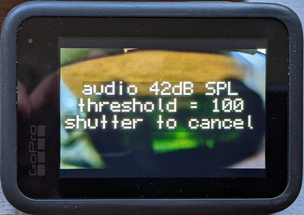

# Sound Pressure Level Capture Trigger

This trigger uses the SPL of the audio detected start and stop captures.  Example: Rocket launches with an uncertain launch time, set the SPL to automatically start a capture when the engines fire.

## Customize SPL Detected Capture

&nbsp;&nbsp;&nbsp;&nbsp;&nbsp;&nbsp;**Start Sensitivity** <input type="range" style="width: 300px;" id="snstvty" name="snstvty" min="30" max="120" value="80"><label for="snstvty"></label>&nbsp;&nbsp;<b id="snstvtytext"></b> dB or above, start capture 
&nbsp;&nbsp;&nbsp;&nbsp;&nbsp;&nbsp;**End Sensitivity** <input type="range" style="width: 300px;" id="esnstvty" name="esnstvty" min="30" max="120" value="80"><label for="esnstvty"></label>&nbsp;&nbsp;<b id="esnstvtytext"></b> dB or below, stop capture 
&nbsp;&nbsp;&nbsp;&nbsp;&nbsp;&nbsp;**Start Delay** <input type="range" style="width: 300px;" id="delay" name="delay" min="0" max="60" value="1"><label for="delay"></label>&nbsp;&nbsp;<b id="delaytext"></b> seconds before reading audio level. 
&nbsp;&nbsp;&nbsp;&nbsp;&nbsp;&nbsp;**Hold Time** <input type="range" style="width: 300px;" id="hold" name="hold" min="0" max="120" value="5"><label for="hold"></label>&nbsp;&nbsp;<b id="holdtext"></b> seconds, to continue recording after audio level has dropped.  

&nbsp;&nbsp;&nbsp;&nbsp;&nbsp;&nbsp;<input type="checkbox" id="repeat" name="repeat" checked> 
<label for="repeat">Repeat SPL triggered capture.</label> 

Note: you will have to manually set the mode in which you capture.  The detector can be combined with the Hindsight feature on HERO9-13. 
 

 

  

 
  <b>GoProQR:</b> <em id="qrtext"></em> 
  <b>Sound Pressure Trigger</b>
 

<button id="copyImg">Copy Image to Clipboard</button>
 
 
Share this QR Code as a URL: <small id="urltext"></small> 
<button id="copyBtn">Copy URL to Clipboard</button>

## Sensitivity Examples (Uncalibrated, so please experiment)

| SPL (dB) at 1m/3ft | Activity         |
|--------------------|------------------|
| 30                 | calm room        |
| 40-60              | conversation     |
| 60-80              | passenger car    |
| 80-90              | busy roadway     |
| 100                | jack hammer      |
| 110                | chain saw        |
| 120                | horn             |

## On Screen Feedback

**Compatibility:** Labs enabled HERO9-13 and BONES
        
updated: September 10, 2024

[More features](..) for Labs enabled cameras

