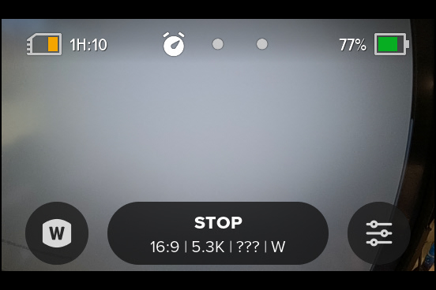

# Stop Motion Mode

A Stop Motion extension where only a single frames is stored per shutter press. Once the Stop motion has started, on the LCD the there is ghost of the previous frame, "onion skinning" to help with character position and speed of movement. This modify timelapse video, so the new preset is under timelapse. 

<video width="640" height="360" controls loop autoplay>
  <source src="stopmotionvideo.mp4" type="video/mp4">
</video>

## Stop Motion controls
 
<input type="checkbox" id="stopmt" name="stopmt" checked><label for="stopmt">Enable Stop Motion</label> 
<input type="checkbox" id="preset" name="preset" checked><label for="preset">Make this as a new preset (best)</label> 
<input type="checkbox" id="permanent" name="permanent"><label for="permanent">If not a present, make this permanent setting (risky)</label> 
<input type="checkbox" id="tall" name="tall"><label for="tall">Use 8:7 (not 16:9)</label> 
<input type="checkbox" id="use5K" name="use5K"><label for="use5K">Use 5.3K (not 4K)</label> 
<input type="checkbox" id="linear" name="linear"><label for="linear">Use Linear (not Wide)</label> 

 

  <canvas id="qr-canvas" width="360" height="360" style="image-rendering: pixelated;"></canvas>
  <b>GoProQR:</b> <em id="qrtext"></em> 
  <b>Dive Mode</b>
 

<button id="copyImg">Copy Image to Clipboard</button>
 
 
Share this QR Code as a URL: <small id="urltext"></small> 
<button id="copyBtn">Copy URL to Clipboard</button>

        

Your new Preset will look like this.  The "???" is normal, as the frame rate is undefined, controlled by your shutter presses.

**Compatibility:** Labs enabled HERO12-13
        
updated: May 30, 2025

[More features](..) for Labs enabled cameras

[BACK](..)

