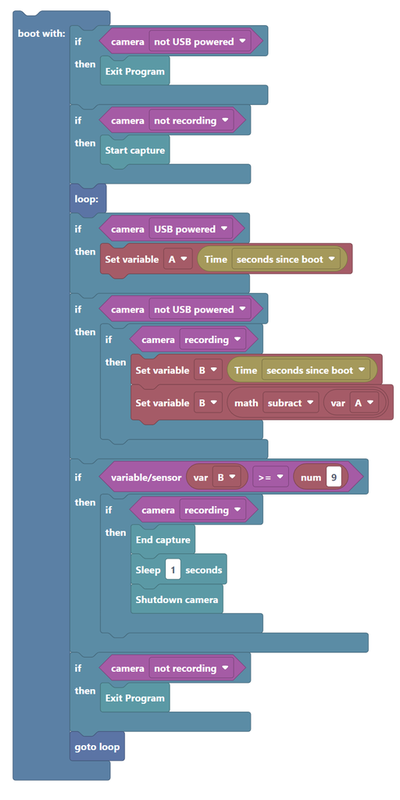

# USB Power Trigger

The camera can use the switching on of USB power to boot the camera, and auto capture upon boot.

End capture after <input type="range" style="width: 200px;" id="tlendsec" name="tlendsec" min="0" max="60" value="2"><label for="tlendsec"></label>&nbsp;&nbsp;<b id="secsendtext"></b> seconds after USB power is off.

**Note:** A battery is required, as the camera needs close captured video when power is removed. Unfortunately this means your battery will eventually discharge, so it is best to have a spare battery if you intended to used this feature as a dedicated dash-cam.  

<input type="checkbox" id="enablenew" name="enablenew" checked> 
<label for="enablenew">Enable for newer Cameras: MAX, HERO10, 11, 11Mini & 12</label> 

Once scanned, power off the camera. Now the camera will start with USB power, end capture and shutdown with USB power off. You can temporarily cancel any capture with the shutter button, power on with USB power, full manual camera control is restored. 
 
<input type="checkbox" id="usefast" name="usefast"> 
<label for="usefast">Enable a faster Labs boot.</label>   
<input type="checkbox" id="disablenew" name="disablenew"> 
<label for="disablenew">Disable the USB trigger.</label>    

 

  

 
  <b>GoProQR:</b> <em id="qrtext"></em> 
  <b>USB Power Trigger</b>
 

<button id="copyImg">Copy Image to Clipboard</button>
 
 
Share this QR Code as a URL: <small id="urltext"></small> 
<button id="copyBtn">Copy URL to Clipboard</button>
        
**Compatibility:** Labs enabled HERO7 (limited), HERO8, HERO9, HERO10, HERO11, 11Mini, HERO12 and MAX         

## BACKGROUND

The Script above was developed using Blocky and visual coding tool configured for Labs scripts.

If you save the above PNG image (of the script), and load that into [**Visual Script Tool**](https://gopro.github.io/labs/build/) via the "Import image", you can enhance it further. 

updated: August 1, 2024

[More features](..) for Labs enabled cameras

