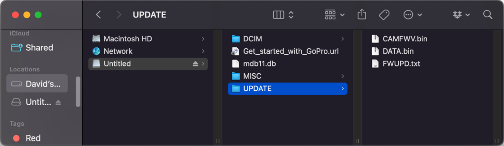

# GoPro Firmware Update Guide for any PC/Mac

## Introduction
This guide will help you update the firmware on your GoPro Camera using a personal computer.

## Prerequisites
1. A GoPro HERO Black, HERO11 Mini or MAX camera
2. A battery with a good charge (50% or better)
3. A microSD card with adapter (this can't be done using a USB connected camera.)
4. A computer from this century 

## Step-by-step Guide

### Step 1: Download the Firmware Update for Labs
- Visit the [page above](..)

### Step 2: Prepare the microSD Card
- Insert your microSD card into the microSD card adapter
- Connect the microSD card adapter to your computer

### Step 3: Copy the Firmware Update Files
- Unzip (extract) the **LABS_HEROxx_aa_bb_7x.zip** file, to discover folder called **UPDATE**
- Note: The UPDATE folder will contain three files CAMFWV.bin, DATA.bin and FWUPD.txt (or similar)
- Copy the entire **UPDATE** folder, not the zip file, or any folder other than UPDATE, to the root directory of the microSD card
- Your SD card contents should like something like this: 
 
or 
	

### Step 4: Update the Camera
- With the GoPro camera powered off
- Insert the microSD card with the firmware update files into the camera
- Power on the GoPro camera
- The camera will beep and turn itself off and on several times. A check mark on the front screen will let you know when it’s done.
- If you get a CAMERA UPDATE FAILED message, remove and reinsert the battery and restart from the beginning.

## Troubleshooting
- If you encounter any issues during the firmware update process, refer to the [GoPro Support Hub](https://community.gopro.com/) for assistance.

